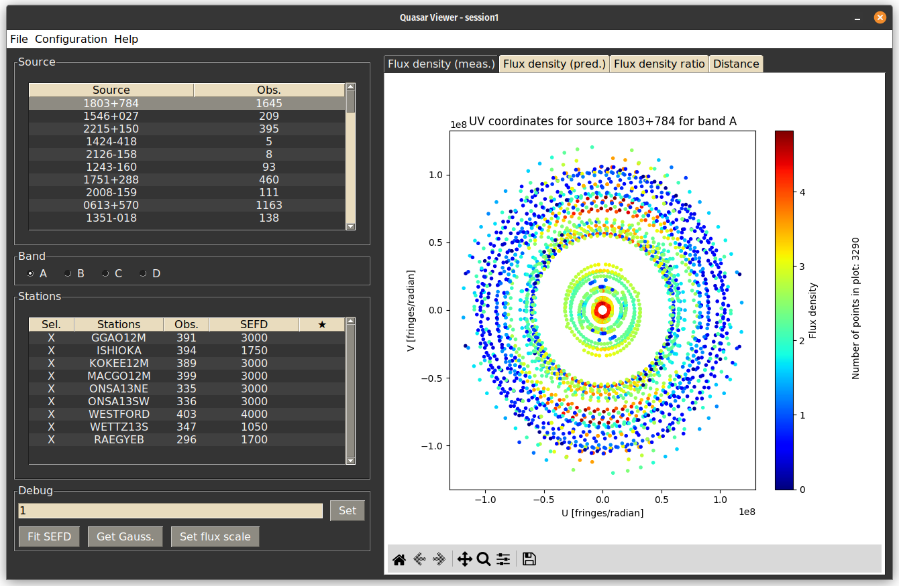

<script
  src="https://cdn.mathjax.org/mathjax/latest/MathJax.js?config=TeX-AMS-MML_HTMLorMML"
  type="text/javascript">
</script>

# Source model evaluation tool

## Description
Application for retrieving SNR, u-v corrdinates and flux density for the A, B, C and D bands from a VGOS session, and for finding optimal SEFD values based on VGOS sessions and source images. 
The program was developed at NVI Inc. by Filip Herbertsson and Samuel Collier 
Ryder during a summer internship in 2023.





## Approach

The project is divided into two parts: band-data preparation and least-squares-fitting of SEFD values.

The band-data preparation is preparation of data for each of the A, B, C and D bands, which the vgos session records on. Recorded data is either provided for each of the 32 channels that are separately, or for all of the channels combined. Thus, the data need to be recalculated if you want the quantities that are given for all channels combined to be given for each band separately.

Least-squares-fitting of SEFD values uses a model of a source and combines that with the SNR values for each band, to try and find the correct SEFD values for the stations in the session.

### Band-data calculations

In order to get the SNR for each of the bands, $SNR_{meas,band}$, we use the SNR that is calculated for all of the bands combined, $SNR_{meas}$, as well as the complex amplitude $V_i$ for each of the channels. We use the equation

$$SNR_{meas,band} = SNR_{meas,vgosDB}\frac{|\sum_i^N V_i|}{|\sum_i^M V_i|}\sqrt{\frac{M}{N}},$$

where $M$ is the total number of channels and $N$ is the number of channels in the band that we are looking for. Important to note is that, although ideally we record on 32 channels with 8 channels per band, sometimes we don't have data for all of the channels.

The u-v coordinates for each observation are converted using the relation

$$u_{vgosDB}\cdot\lambda_{vgosDB} = u_{band}\cdot\lambda_{band},$$

where $u_{vgosDB}$ and $u_{band}$ are the u-coordinates for all bands combined and for a single band respectively, $\lambda_{vgosDB}$ and $\lambda_{band}$ are the average wavelength of all bands combined and of a single band respectively. In order to calculate the v-coordinate, a similar equation is used. This relation was tested against using the coordinates of the observing stations in the terrestrial reference frame and their direction in the sky when looking at the source to calculate the u-v coordinates, and it appeared to agree closely.

Theoretically, you can get the predicted SNR from a flux density model of a source by using the following equation

$$SNR_{pred,band} = \eta\frac{flux\ density_{band}}{\sqrt{SEFD_i\cdot SEFD_j}}\sqrt{sample\ rate\cdot integration\ time},$$

where the $sample\ rate$ and $integration\ time$ can be found in the vgosDB, and the constant $\eta=0.617502$ for vgos sessions. The SEFD values need to be known for both stations involved in the observation. When plotting the flux density for a session and a source, this equation is turned around to solve for flux density instead of SNR, and the measured SNR is used instead of the predicted.

### Least-squares-fit calculations

As a starting point, the SEFD values for a station is taken from the sked catalog, with the SEFD for the A-band being the SEFD for the X-band and the SEFDs for the B, C and D bands being the SEFD for the S-band.

We start by defining the quantity $SNR_{bit}$ as

$$SNR_{bit} = \frac{SNR}{\sqrt{sample\ rate\cdot integration\ time}} = \eta\frac{flux\ density}{\sqrt{SEFD_i\cdot SEFD_j}}$$

From here on, we will refer to $SNR_{bit}$ as $SNR$. We want to minimize the quantity

$$D_{n} = \ln{(SNR_{true})} - \ln{(SNR_{meas})},$$

where $i$ and $j$ represent the two stations involved in the observation, $n$ is the observation, $SNR_{true}$ is the true SNR and $SNR_{meas}$ is the measured SNR. However we don't know what $SNR_{true}$ is. Instead, we have to use the predicted SNR $SNR_{pred}$ form our model, and rewrite the equation to

$$D_{n} = \ln{\left(\frac{SNR_{pred}}{SNR_{meas}}\right)_{i,j}} - p_i - p_j,$$

where $p_i$ and $p_j$ are correction factors that we can use to modify the SEFD values of the stations according to

$$SEFD_{true,i} = SEFD_{sked,i}e^{2p_i}.$$

This should be the true SEFD value of the station $i$. We want to minimize the quantity

$$\sum_n D_{n}(p)^2,$$

and we do so by solving the system of equations described by

$$NP = B.$$

Here, $P$ is the vector of the values $p_i$ for the stations. $N$ is a matrix where the elements are

$$N_{i,j} = \begin{cases}\text{number of observations involving antenna}\ i\quad &\text{if}\ i=j\\ \text{number of observations involving antenna}\ i\ \text{and}\ j\quad &\text{if}\ i\neq j\end{cases}.$$

and $B$ is a vector where the elements are

$$B_k = \sum_n\log\left(\frac{SNR_{pred}}{SNR_{meas}}\right)_{i,j}\ \text{where}\ k=i\ \text{or}\ k=j$$

## How to install

To install the program, you need to clone the GitHub repository and install the 
required libraries. This can be done by running the following commands in the terminal:

```bash
$ git clone https://github.com/SamuelCr99/source_model_evaluation.git
$ pip install -r requirements.txt
```

## How to use the GUI
To run the program, run the main.py file: 

```bash
$ python3 main.py
```

Make sure this is done from the root directory of the repository, if not the program will not be able to find the required files.

### Load data

#### Load session 
To load a session into the gui, click on the "Load session" button under the "File"
tab. This session folder should be a VGOS DB.  

#### Load fits file
To load a fits into the gui, click on the "Load fits" button under the "File"
tab. 

### Plotting
After loading a session, click on one of the sources to plot information from the
source. To change which band is plotted simply click on one of the four radio 
buttons under band. There will be 4 different plots. 

1. The u, v coordinates and flux density of the source based on data from the session
folder. 
2. The u, v coordinates and flux density of the source based on data from the fits
file.
3. The ratio between the flux density of the source based on data from the session
folder and the flux density of the source based on data from the fits file.  
4. Flux density to the distance from the center of the source based on data from the
session folder.

#### Adjusting plot
There are a number of ways of adjusting the plot. 


- Adjust which stations are plotted by clicking the "Sel." column in the Stations
table.
- Adjust which station are highlighted by clicking the "★" column. This will cause
the points from that station to be highlighted with a star. If two stations are 
highlighted, the points where both stations are present will be highlighted.   
- Adjust the SEFD value of a station by clicking the "SEFD" column. This will change
the flux density for the points from that station. 

#### Setting optimal SEFD values automatically 
To find the optimal SEFD values for each station for that session and band click 
the "Fit SEFD" button. 

### Using the configuration settings

Changes made to the SEFD values for each station and band can be saved, so that they are consistent when using the program at different times.

* To save the changes made to the stations click the "Save" button under the
"Configuration" tab.

* To restore changes to latest save file click the "Restore to saved" button under
the "Configuration" tab.

* To restore all SEFD values to their original state, click the "Delete" button under
the "Configuration" tab.

## How to use the script mode

The script mode uses three commands:

* `prepare`: Prepares the band-data from a vgos session, as well as prepare a config-file containing the SEFD-values for all the stations present in the session.
* `plot`: Uses the prepared data and config file to generate plots for specific sources. There are four kinds of plots that can be created, depending on what other flags are provided:
    * A plot of the flux density, calculated from the measured SNR and the SEFD values of the stations.
    * A plot of the flux density, as predicted by a model.
    * A plot of the ratio between the predicted and the measured flux density.
    * A plot of the measured flux density as a function of the distance from the center of the source.
* `lsf`: Uses the prepared data and the SEFD config, as well as a model of a source provided with a FITS-file, to do a least-squares-fit of the SEFD values for each station, and updates the config file accordingly.

More information of which variables and flags are available for the different commands can be found by using

```bash
$ python3 main.py <command> --help
```

### Preparing a vgos session

In order to prepare the band-data from a session, the following command should be run

```bash
$ python3 main.py prepare band-data <session_dir>
```

If you want to prepare the config file containing SEFD values instead, you use

```bash
$ python3 main.py prepare sefd <session_dir>
```

In order to run the `plot` and the `lsf` command, you will need both files. Thus, you can prepare both using

```bash
$ python3 main.py prepare all <session_dir>
```

By default, the data is saved in the directory `data/derived`. If you want to save the data somewhere else for processing, you can use the `--save_dir` flag to specify the directory. The files are always named `datapoints.csv` and `config.csv`, and are CSV files.

### Plotting

One of the main uses of this utility is the ability to make plots of sources from data obtained in vgos (or S-X) sessions. After having prepared the session, this can be done by running the command

```bash
$ python3 main.py plot <source>
```

where `source` is the B1950 name of the source. The available sources can be found by checking the list in the GUI, or by looking in the data file that was prepared.

Different flags can adjust which observations should be included. This is useful if you for example want to look at a single band, or if you want to exclude a specific station. The flags are
* `--bands` to only look at specific bands
* `--ignored_bands` to exclude specific bands
* `--stations` to only look at specific stations
* `--ignored_stations` to exclude specific stations
* `--stations` to only look at specific stations
* `--ignored_stations` to exclude specific stations
* `--baselines` to only look at specific baselines
* `--ignored_baselines` to exclude specific baselines

An example of this would be running the following command

```bash
$ python3 main.py plot 1803+784 --bands A --ignored_stations KOKEE12M,ISHIOKA
```

which should plot the source __1803+784__ in the __A__ band, ignoring data obtained by stations __KOKEE12M__ and __ISHIOKA__.  

If you chose to prepare the data and config files in a different location than the default, you can specify the paths to these files using the `--data` and `--config` flags respectively. This would be the full paths, not only the directory.

Plots can also be saved instead of shown. This happens if you specify a `--save_dir`.

#### Plotting prediction model

If you want to get a plot of the flux density from a source model, or you want to get a plot of the ratio between the predicted and measured flux density, you need to provide a FITS-file that the program can construct a model from. This is done by providing the `--fits_file` flag and then the path to the file. The model can be modified using different flags.
* `--model` specifies which algorithm should be used to generate the model. The options are `img` or `raw`. The default is `img`, and this is currently the recommended one
* `--scale_uv` specifies a scaling factor for the model in the u-v coordinates
* `--scale_flux` specifies a scaling factor for the flux density of the model

Fits file can be downloaded from https://astrogeo.org/vlbi_images/.

### Least-squares-fit of SEFD values

The data from a session as well as a model of a source can be used to fit the SEFD values of the stations involved in the session. This is done by running

```bash
$ python3 main.py lsf <source> <fits_file>
```

All flags mentioned in the __Plotting__ can be used to specify which data should be used, and if/how the model should be modified. The only exceptions are the `--save_dir` flag, as `lsf` always updates the config file provided, and the `--fits_file` flag, as this is a required argument instead.

## Acknowledgements

The data supplied in this project comes from Goddard Space Flight Center. The calculations to convert vgos session data from single band to multiple bands was made by John Gipson of NVI Inc., as well as the equations for the least-squares-fit.

## Known issues and limitations
* The scaling of the source model in the u-v coordinates as well as in the flux density is incosistent with the flux density obtained by the measured SNR.
* The source model predicts very different shapes of the same source between sessions, even when the time between sessions is short.
* Least-squares-fitting can only be done on a single source in a given session. Ideally, this should be done using all sources (or a subset thereof) available in the session at the same time.
* SEFD values are considered to be constant for a given session. However, SEFD values are known to vary with the elevation of the telescope.