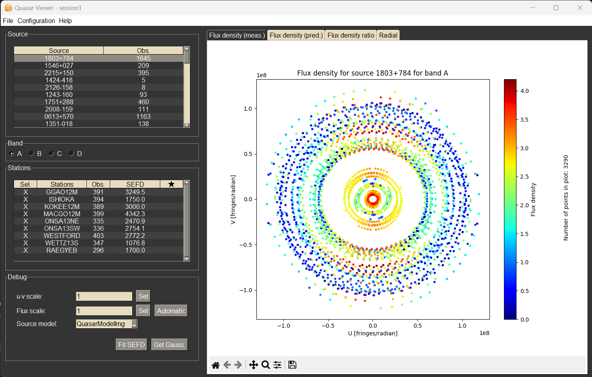

# Good name

## Description

Plots the baseline and other related quantities between two VLBI stations. The program was developed at NVI Inc. by Filip Herbertsson and Samuel Collier Ryder during a summer internship in 2023.




## How to install

To install the program, you need to clone the GitHub repository and install the required libraries with

```bash
$ git clone https://github.com/SamuelCr99/VLBI_baseline_movement_plotter.git
$ pip install -r requirements.txt
```

## How to use
To run the program, run the main.py file: 

```bash
$ python3 main.py
```

### Load session 
To load a session into the gui, click on the "Load session" button under the "File"
tab. This session folder should be a VGOS DB.  

### Plotting
After loading a session, click on one of the sources to plot the u,v coordinates 
and the flux density. To change which band is plotted simply click on one of the
four radio buttons under band. 

### Adjusting plot


